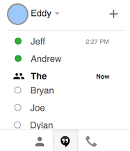

# Sort Hangouts Google Chrome Extension

**Problem:** The Hangouts tab is not sorted and the chats tab doesn't show my Hangouts!

**Solution:**

This Google Chrome Extension sorts the Google Hangouts tab in GMail by status. The new order after installation is:

* *Online* contacts at the top
* *Hangouts* in the middle
* *Offline* contacts at the bottom, sorted from A-Z

[Click here to view it in the Chrome Web Store](https://chrome.google.com/webstore/detail/sort-hangouts-tab-in-gmai/kidpfddmdpkgilenchiaeehgfilnhapf).

The sort order for Online contacts and Hangouts remain the same (last opened) while the offline contacts are sorted from A-Z so they can be found easier.

## Issues

If there's an issue with the extension, please go to the issue tab of this repository and search for an existing issue. If none exist that describe your issue, feel free to create a new issue.

## License

This software is MIT licensed. See the [LICENSE.md](LICENSE.md) file for details on what that means.
